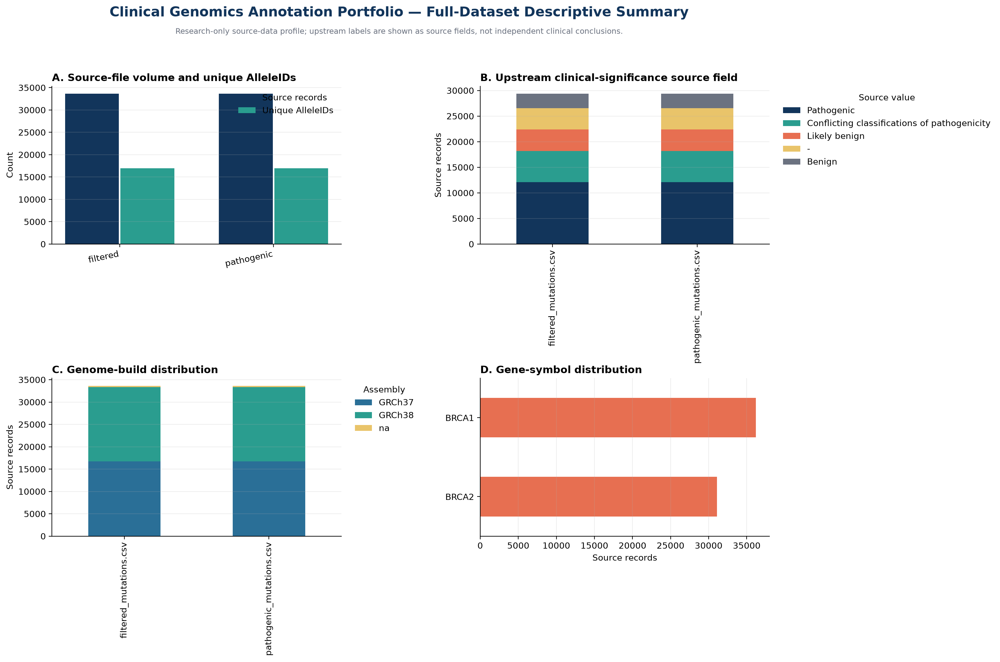

# Portfolio Data Summary and Findings Presentation

**Generated:** 2026-08-23T21:45:57.727602+00:00  
**Input:** `data/processed/full_variants_canonical.csv`

> **Research-only boundary:** This report presents descriptive summaries of public, pre-annotated source fields after ETL. It does not independently validate source assertions, classify variants clinically, diagnose individuals, assess patient-specific risk, or support treatment recommendations.



## Executive summary

The ETL workflow processed **67,290 source records** across **2 full upstream files** and observed **16,977 unique upstream ClinVar AlleIDs**. The source files share **16,977 AlleleIDs**, which is why the ETL retains source-file provenance and treats cross-file records as traceable source inputs rather than silently deduplicating them.

## Source-volume summary

| Source file | Source records | Unique upstream AlleleIDs |
|---|---:|---:|
| filtered_mutations.csv | 33,645 | 16,977 |
| pathogenic_mutations.csv | 33,645 | 16,977 |

## Gene-symbol source-field distribution

| Gene symbol | Source records |
|---|---:|
| BRCA2 | 31,098 |
| BRCA1 | 36,192 |

## How findings should be presented

Use the dashboard and the tables above to explain the **data pipeline**, not to make clinical claims. A concise portfolio presentation is:

> “I began with two full public, pre-annotated source tables. My ETL process preserved each source file, hash, and row lineage; standardised the schema; profiled source-field distributions; compared cross-file overlap; and selected a documented GRCh38 subset for focused annotation review. The final evidence table reports source assertions, molecular annotation, and current public-resource context while preserving a research-only boundary.”

## Interpretation notes

The clinical-significance and genome-build charts display upstream source fields. They are useful for checking data composition, potential schema differences, and the selection path to the GRCh38 review subset. They are not evidence of prevalence, diagnostic performance, a new pathogenicity claim, or cancer-treatment relevance.

## Reproducibility

Regenerate these outputs after running the ETL step:

```bash
python src/generate_portfolio_report.py \
  --input data/processed/full_variants_canonical.csv \
  --report-dir reports
```

The report is intended to accompany `full_dataset_etl_report.md`, `data_manifest.json`, and the final completed research-evidence table.
